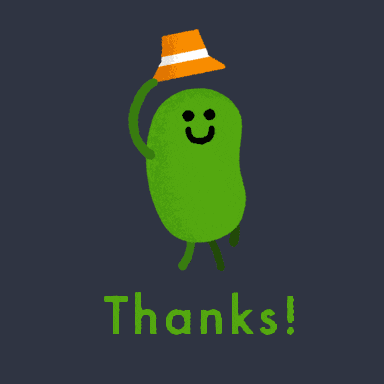

```{r setup, include=FALSE}
htmltools::tagList(
  xaringanExtra::use_clipboard(
    button_text = "<i class=\"fa fa-clipboard\"></i>",
    success_text = "<i class=\"fa fa-check\" style=\"color: #90BE6D\"></i>",
  ),
  rmarkdown::html_dependency_font_awesome()
)

xaringanExtra::use_panelset()
```


---

# Diapositiva 1

---

# Diapositiva 2

---

# Pestañas en la diapositiva

.panelset.sideways[

.panel[.panel-name[Pestaña] 

```{r, fig.height=5, fig.height=6}
plot(iris)
```


]

.panel[.panel-name[Pestaña 2] 


]

.panel[.panel-name[Pestaña 3] 

]


]


---
class: inverse, center, middle

<center>

</center>